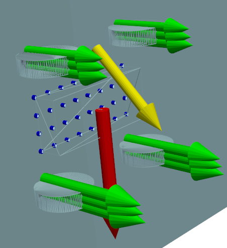
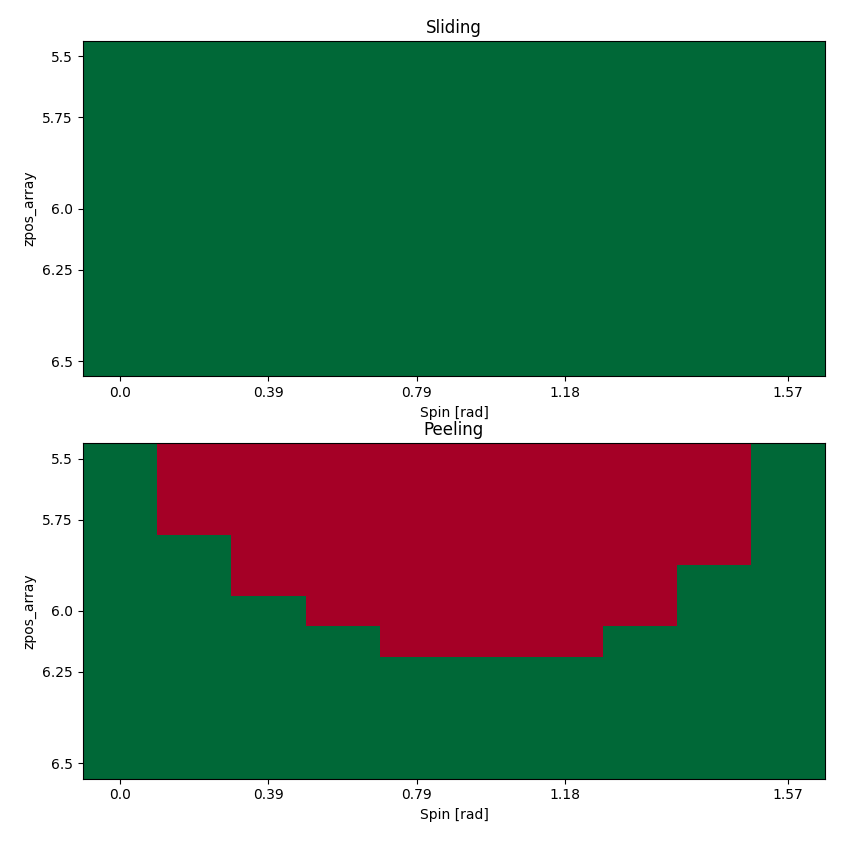
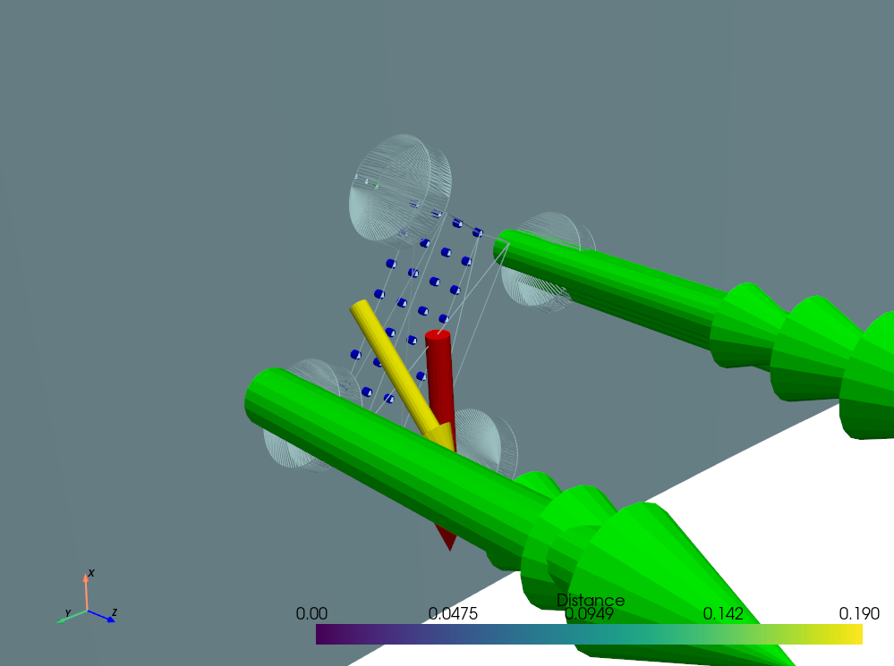

**Must run files from WallClimberCalculator folder**

Required python packages:
* numpy
* pandas
* math
* scipy
* matplotlib
* pyvista
* mpl_toolkits

The purpose of this code is to find the failure modes of a wall climbing robot by balancing the forces and moments that are acting on it in each potential orientation that it will encounter. The pipeline for this begins with a .yaml file that defines all of the necessary parameters for a specific robot design. A minimization algorithm is applied to a custom objective function that renders the robot and its environment in 3 dimensions and returns the sum of the squared forces and moments. Minimizing this objective function allows the algorithm to find the point at which the sum of all of the forces and moments are balanced. At this point, failure modes are calculated and returned based on these individual forces. The Magnetic and Suction folders differ in the robot designs, failure mode calculations, and environments rendered. The main functions are located in the xxxSolver.py files.

### **Magnetic Solver Guide**

The magnetic version is held within the Magnetic folder.

The three files that you need are:

- MagneticCrawlerSolver.py (Main and optimization loop)
- forcemoment_balancing_tool.py (objective function)
- wombot_variables.yaml (parameters)



### **Forces**

- Gravity (Red)
- Wheel Normal (Green)
- Magnet Array (Blue)
- Tether Force (Yellow)

### **Parameters**

- **Descriptions**
    
    **g**: gravity constant [ft/s^2]
    
    **m**: mass [kg]
    
    **com_height**: height of center of mass above robot center [cm]
    
    **Magnetic Array**
    
    **width_array**: width of the magnetic array [cm]
    
    **width_array_resolution**: number of magnets along the width direction [cm]
    
    **length_array**: length of the magnetic array [cm]
    
    **length_array_resolution**: number of magnets along the length direction [cm]
    
    The next two play into the inverse cube law estimation of magnetic force: **F = B/(x+A)^3**
    
    **strength_array**: B [N*cm^3]
    
    **strength_array_offset**: A [cm]
    
    **strength_array_multiplier**: additional multiplier based on array backplate [~]
    
    **zpos_array**: depth of magnet array from robot center [cm]
    
    **Wheel**
    
    **wheel_resolution**: number of points to split the wheel into for calculation [~]
    
    **track_wheel**: center to center distance between the wheels in the width direction [cm]
    
    **wheelbase_wheel**: center to center distance between the wheels in the length direction [cm]
    
    **radius_wheel**: radius of the wheels [cm]
    
    **height_wheel**: width of the wheels [cm]
    
    **stiffness_wheel**: wheels compression modeled as a simple spring with a spring constant [N/cm]
    
    **static_friction_wheel**: static friction coefficient of the wheels with the surface of the cask [~]
    
    **Cask**
    
    **radius_cask**: radius of the cylindrical cask that the robot traverses [cm]
    
    **height_cask**: height of the cylindrical cask (for rendering purposes only) [cm]
    
    **External Force**
    
    **Fc**: force location with respect to robot frame [cm cm cm]
    
    **Fv**: force direction with respect to world frame; unit vector (will be normalized) [cm cm cm]
    
    **Fmag**: magnitude of external force [N]
    

Any parameter can be passed through as an “override parameter” to test alternate values programmatically.

In order to do so, you must pass the optional “override_key” parameter as a string that is identical to the name of the parameter in the yaml file (seen above in the Descriptions drop down). You must also pass the “override_vars” parameter containing a list of values that will replace the value of the parameter in the yaml file. In this way you can test the robot with a range of alternate values for any parameter.

### **Rendering**

The robot can be optionally rendered by the Single_Test function by toggling the “render” optional input variable. This option will render the robot and all of its forces in a 3D interactive window using pyvista.

### Failure Mode Analysis

For the magnetic robot two failure modes are calculated.

**Sliding**: Returns True when the vertical force on the robot (mostly from gravity) is larger than the max static friction from the wheels (based on normal forces and friction coefficient)

**Peeling**: Returns True when any of the wheels are out of contact with the wall. In this case the core assumptions of the force calculations fall apart (i.e. the wheel generates a force toward the wall) so we assume that in reality the robot would begin to peel off of the wall. This assumption was necessary to craft an objective function with a minimum at the correct solution.

### **Results**

A report on whether the optimization succeeded and all of the forces that are generated can be printed to the console by toggling the “verbose” optional input variable inthe Single_Test function.

The results of a full orientation test (which will run a Single_Test on the full range of spins that the robot could encounter) can be written to csv files (with the “write” optional input) and can be plotted directly (with the “plot” optional input).

- **Example Application (Ride Heights)**
    
    So, for this test we are going to try to figure out a safe range of magnet array ride heights. I am going to set go through the process of setting up the code to run a test and explain my process of analyzing the results.
    
    Assuming that python is installed and the repo is cloned, the first step is to go to the main function of the [MagneticCrawlerSolver.py](http://MagneticCrawlerSolver.py) file.
    
    The first line of code that you need to worry about is importing the yaml file that defines the robot.
    
    ```jsx
    setup_vars = load_yaml(PATH + "wombot_variables.yaml")
    ```
    
    I already created the file “wombot_variables.yaml” based on the Gen7 robot, but if you are trying to test a different robot you will have to go through and update the values within or create a new yaml file. Explanations of what each of the variables mean are above in the “Descriptions” toggle.
    
    The next few lines of code that you will have to write are to define a list of override values for the parameter that you would like to vary. For this example we would like to vary the ride height values, however this is not a value that we can directly set (it is dependent of the forces). Therefore we will vary the **zpos_array** parameter. The true zpos_array value is 5.9, so I have created a range that goes slightly higher and lower than that value.
    
    ```jsx
    override_zpos_array = np.linspace(5.5,6.5,11)
    ```
    
    The final line of code is to call the **Full_Spin_Test_Moments** function to complete the analysis. I have set the **resolution** to 10, this means that it will test 10 intermediate spin values between 0 and pi/2. We pass in the **setup_vars** that were imported above. We set the **override_key** to the name of the parameter that we would like to vary, in this case it is “zpos_array”. We pass in our list of override variable values to the **override_vars** parameter.  In this case I am setting the **plot** optional input to *True*, which will generate simple plots of the results. The **write** optional parameter will write the results to csv files if set to *True*, which you can then plot or analyze however you like.
    
    ```jsx
    Full_Spin_Test_Moments(10,setup_vars,override_key='zpos_array',override_vars=override_zpos_array,plot=True,write=False)
    ```
    
    Now run it! (make sure from the Wall_Climber_Calculator directory)
    
    

    As you can see, the robot failed in peeling at at some of these array heights. It looks like when the robot was at a 45 degree angle of spin (which maximizes the magnet height) and lower z positions, the robot began to peel.
    
    Now, to understand how the peeling condition is met I will show an image of a render from one of thes red boxes, the way I will do this is by running a **Single_Test_Moments**, in this case I will do it at (spin, zpos_array) = (1, 6).
    
    ```jsx
    Single_Test_Moments(1, setup_vars, override_key="zpos_array", override_var=6, render=True, verbose=True)
    ```

	
    
    As you can see, one of the wheels is out of contact with the wall, and we consider that a failure of the peeling condition.